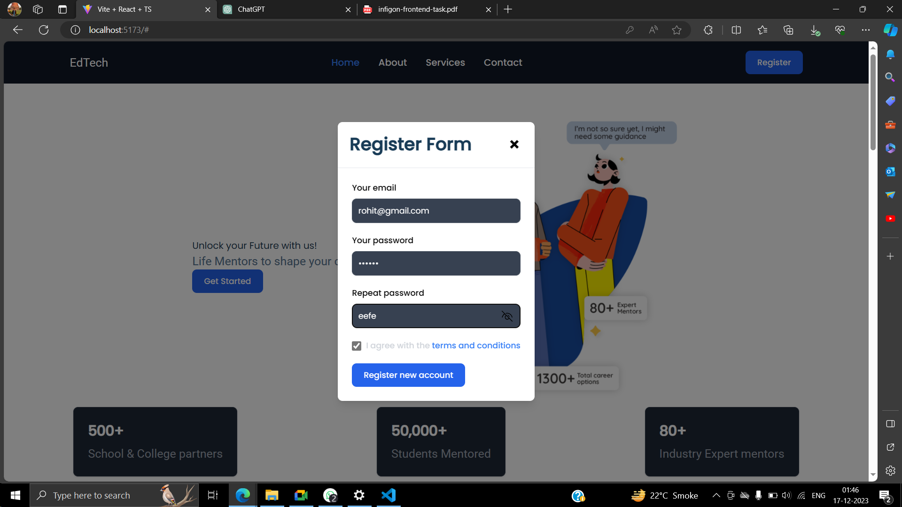
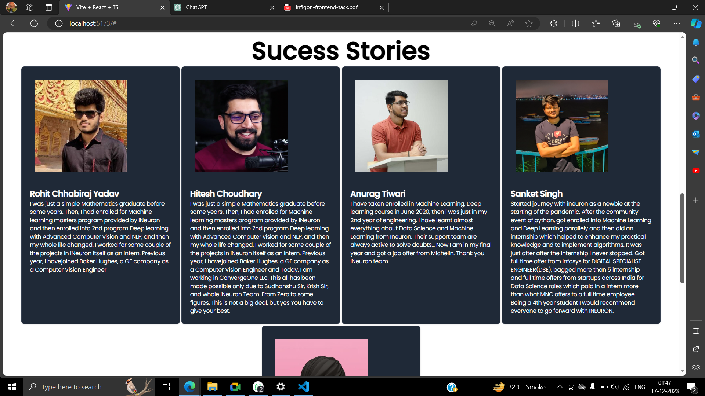
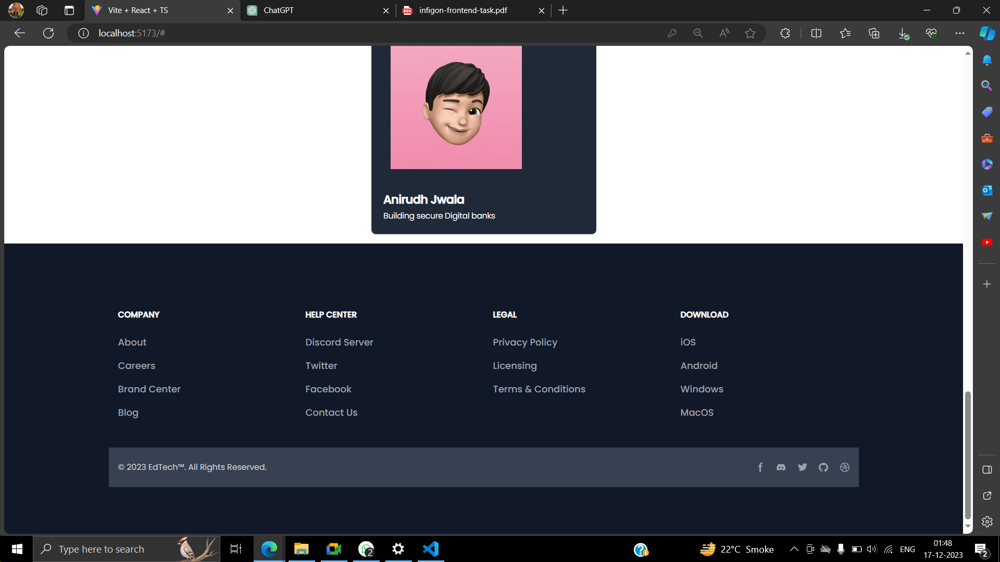

# Infigon Assignment
 Frontend Developer Assignment

 # EdTech
## Project Description

The EdTech React website is an innovative platform developed using React and Vite, seamlessly integrated with Tailwind CSS to ensure a modern and responsive design. The project focuses on providing an enriching user experience with a well-organized navigation bar, reusable components, modals, forms, buttons, and a prominent registration feature.

## Output 

## Key Features
### Navigation Bar

The website boasts a user-friendly navigation bar featuring essential links, ensuring easy navigation throughout the platform.

### Reusable Components
Leveraging the power of React, the project incorporates reusable components, enhancing code modularity and maintainability.

### Modals
Interactive modals are implemented to facilitate user engagement, offering a dynamic and responsive experience.

### Form and Button
An intuitive and user-friendly form, coupled with styled buttons, enhances the overall usability of the website.

### Register Button
A prominent "Register" button encourages user sign-up, providing seamless access to EdTech's offerings.

### EdTech Advertisement Section
The upper part of the webpage is dedicated to showcasing EdTech-related content and advertisements, utilizing striking visuals to capture visitor attention.

### Course Cards
Three visually appealing cards are created to represent different courses. Each card displays key information, including course name, rating, and price, ensuring a clear overview for potential students.

### Testimonials
The website features testimonials from various individuals who have benefited from EdTech's programs. Each testimonial includes a product image, individual name, and a detailed success narrative, establishing credibility and showcasing the impact of the courses.

### Footer Section
The footer section serves as a comprehensive endpoint, containing social media handles for user engagement and transparency. Privacy-related links are included to ensure user trust and compliance.

## Conclusion
The EdTech React website is a dynamic and feature-rich platform designed to provide an immersive educational experience. The integration of React, Vite, and Tailwind CSS not only ensures a visually appealing interface but also enhances the website's responsiveness and user interaction. With a focus on usability and engagement, this project sets out to make educational services accessible and compelling for users.

Note: This overview provides a brief summary of the key features and components integrated into your EdTech React website. Adjustments can be made based on your project's specific details and requirements.

