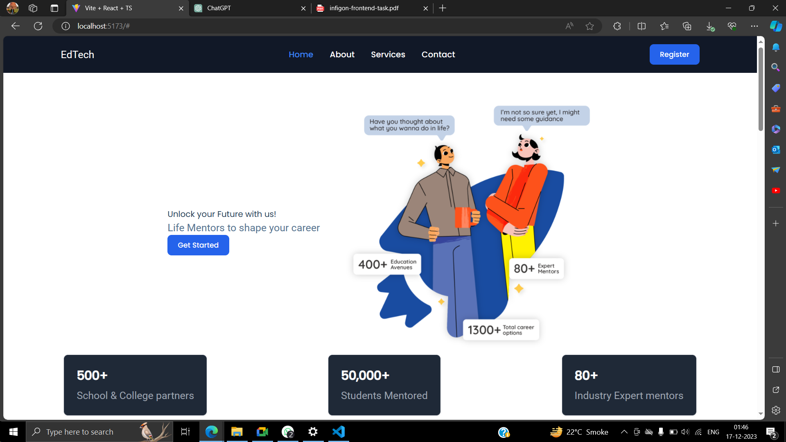
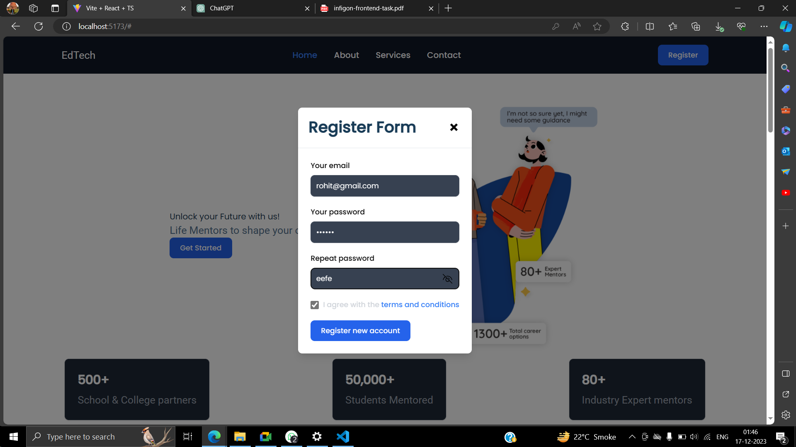
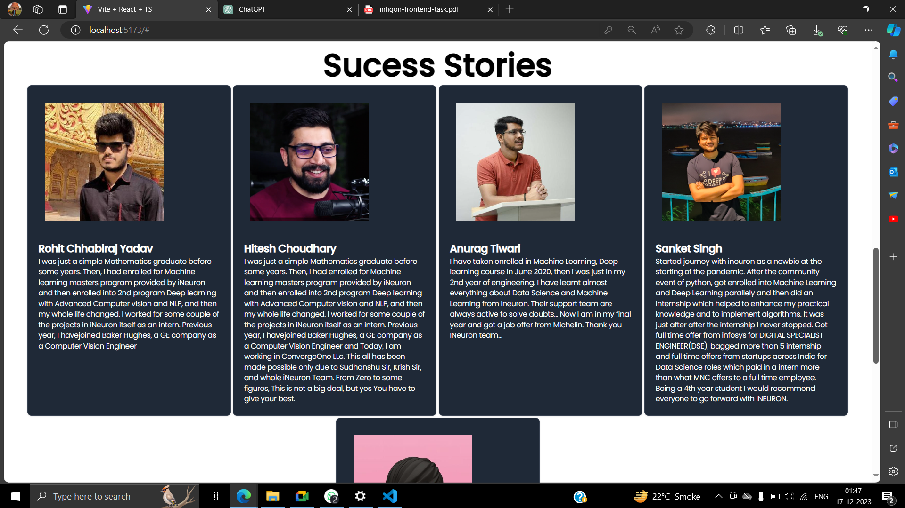
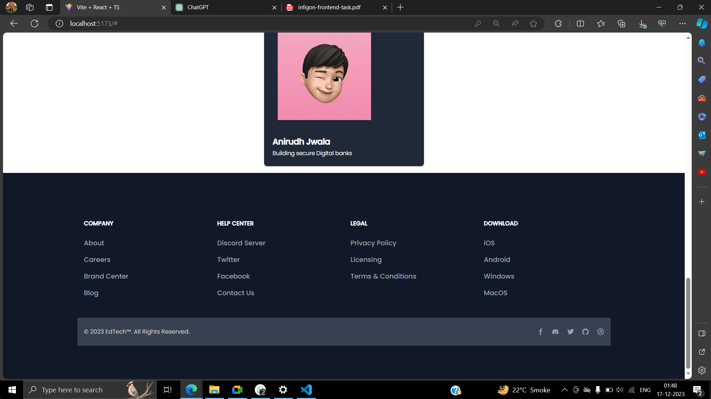

# Infigon Assignment
 Frontend Developer Assignment


 # EdTech
## Project Description

The EdTech React website is an innovative platform developed using React and Vite, seamlessly integrated with Tailwind CSS to ensure a modern and responsive design. The project focuses on providing an enriching user experience with a well-organized navigation bar, reusable components, modals, forms, buttons, and a prominent registration feature.

## Output 









## Key Features
### Navigation Bar

The website boasts a user-friendly navigation bar featuring essential links, ensuring easy navigation throughout the platform.

### Reusable Components
Leveraging the power of React, the project incorporates reusable components, enhancing code modularity and maintainability.

### Modals
Interactive modals are implemented to facilitate user engagement, offering a dynamic and responsive experience.

### Form and Button
An intuitive and user-friendly form, coupled with styled buttons, enhances the overall usability of the website.

### Register Button
A prominent "Register" button encourages user sign-up, providing seamless access to EdTech's offerings.

### EdTech Advertisement Section
The upper part of the webpage is dedicated to showcasing EdTech-related content and advertisements, utilizing striking visuals to capture visitor attention.

### Course Cards
Three visually appealing cards are created to represent different courses. Each card displays key information, including course name, rating, and price, ensuring a clear overview for potential students.

### Testimonials
The website features testimonials from various individuals who have benefited from EdTech's programs. Each testimonial includes a product image, individual name, and a detailed success narrative, establishing credibility and showcasing the impact of the courses.

### Footer Section
The footer section serves as a comprehensive endpoint, containing social media handles for user engagement and transparency. Privacy-related links are included to ensure user trust and compliance.

## Steps
### Cammands

```bash
1. npm create vite@latest
2. npm install -D tailwindcss postcss autoprefixer
   npx tailwindcss init -p
3. npm sb init  
``````
### App.tsx
```typescript

import './App.css'
import CourseSection from './components/CourseSection'
import Footer from './components/Footer'
import HeroPage from './components/HeroPage'
import NavBar from './components/NavBar'
import ProgressCard from './components/ProgressCard'
import Testimonials from './components/Testimonials'

function App() {
  

  return (
    <>
    {/* navbar */}
        <NavBar/>

    {/* carousel */}
    <HeroPage/>

    {/* progress items */}
    <ProgressCard/>

    {/* course list */}
    <CourseSection/>

    <Testimonials/>

    <Footer/>

    </>
  )
}

export default App


```
### Modal.tsx
```typescript
import React, { ReactNode } from 'react';
import Form from './Form';

interface ModalProps {
  isOpen: boolean;
  onClose: () => void;
  children: ReactNode;
}

const Modal: React.FC<ModalProps> = ({ isOpen, onClose }) => {
  const overlayStyles = isOpen
    ? 'fixed inset-0 z-10 flex items-center justify-center bg-black bg-opacity-50'
    : 'hidden';

  const modalStyles = isOpen
    ? 'relative w-auto max-w-3xl mx-auto my-6 opacity-100 transform scale-100'
    : 'opacity-0 transform scale-95';

  return (
    <div className={overlayStyles} onClick={onClose}>

      <div
        className={`bg-white border-0 rounded-lg shadow-lg outline-none focus:outline-none ${modalStyles}`}
        onClick={(e) => e.stopPropagation()}
      >

        <div className="relative flex flex-col w-full">

          <div className="flex items-start justify-between p-5 border-b border-solid border-blueGray-200 rounded-t">
            <h3 className="text-3xl font-semibold">Register Form</h3>

            <button
              className="p-1 ml-auto bg-transparent border-0 text-black float-right text-3xl leading-none font-semibold outline-none focus:outline-none"
              onClick={onClose}
            >
              <span className="text-black">×</span>
            </button>

          </div>

          <div className="relative p-6 flex-auto">
            {/* {children} */}
            <Form />
          </div>
        </div>

      </div>

    </div>
  );
};

export default Modal;
```


### NavBar.tsx
```typescript
import  { useState } from 'react';
import Button from './Button';
import Modal from './Modal';

function NavBar() {
  const [isModalOpen, setModalOpen] = useState(false);

  const openModal = () => {
    setModalOpen(true);
  };

  const closeModal = () => {
    setModalOpen(false);
  };

  return (
    <>
      <nav className="bg-white border-gray-200 dark:bg-gray-900">

        <div className="max-w-screen-xl flex flex-wrap items-center justify-between mx-auto p-4">
          
          <a href="#" className="flex items-center space-x-3 rtl:space-x-reverse">
            <p className='text-white'>EdTech</p>
          </a>

          <div className="flex md:order-2 space-x-3 md:space-x-0 rtl:space-x-reverse">
            {/* Integrate the openModal function directly into the onClick */}
            <Button title="Register" onClick={openModal} />
          </div>

          <div className="items-center justify-between hidden w-full md:flex md:w-auto md:order-1" >
                    <ul className="flex flex-col font-medium p-4 md:p-0 mt-4 border border-gray-100 rounded-lg bg-gray-50 md:space-x-8 rtl:space-x-reverse md:flex-row md:mt-0 md:border-0 md:bg-white dark:bg-gray-800 md:dark:bg-gray-900 dark:border-gray-700">
                    <li>
                        <a href="#" className="block py-2 px-3 md:p-0 text-white bg-blue-700 rounded md:bg-transparent md:text-blue-700 md:dark:text-blue-500">Home</a>
                    </li>
                    <li>
                        <a href="#" className="block py-2 px-3 md:p-0 text-gray-900 rounded hover:bg-gray-100 md:hover:bg-transparent md:hover:text-blue-700 md:dark:hover:text-blue-500 dark:text-white dark:hover:bg-gray-700 dark:hover:text-white md:dark:hover:bg-transparent dark:border-gray-700">About</a>
                    </li>
                    <li>
                        <a href="#" className="block py-2 px-3 md:p-0 text-gray-900 rounded hover:bg-gray-100 md:hover:bg-transparent md:hover:text-blue-700 d:dark:hover:text-blue-500 dark:text-white dark:hover:bg-gray-700 dark:hover:text-white md:dark:hover:bg-transparent dark:border-gray-700">Services</a>
                    </li>
                    <li>
                        <a href="#" className="block py-2 px-3 md:p-0 text-gray-900 rounded hover:bg-gray-100 md:hover:bg-transparent md:hover:text-blue-700 md:dark:hover:text-blue-500 dark:text-white dark:hover:bg-gray-700 dark:hover:text-white md:dark:hover:bg-transparent dark:border-gray-700">Contact</a>
                    </li>
                    </ul>
          </div>

        </div>

      </nav>

      {/* Render the Modal component */}
      <Modal isOpen={isModalOpen} onClose={closeModal}>
        {/* Modal content goes here */}
        <p>Modal Content Goes Here</p>
        <button onClick={closeModal}>Close Modal</button>
      </Modal>
    </>
  );
}

export default NavBar;
```

### Form.tsx
```Typescript
function Form() {
    return (
      <>
          
         

<form className="max-w-sm mx-auto">
  <div className="mb-5">
    <label htmlFor="email" className="block mb-2 text-sm font-medium text-gray-900 dark:text-black">Your email</label>
    <input type="email" id="email" className="shadow-sm bg-gray-50 border border-gray-300 text-gray-900 text-sm rounded-lg focus:ring-blue-500 focus:border-blue-500 block w-full p-2.5 dark:bg-gray-700 dark:border-gray-600 dark:placeholder-gray-400 dark:text-white dark:focus:ring-blue-500 dark:focus:border-blue-500 dark:shadow-sm-light" placeholder="name@flowbite.com" required/>
  </div>
  <div className="mb-5">
    <label htmlFor="password" className="block mb-2 text-sm font-medium text-gray-900 dark:text-black">Your password</label>
    <input type="password" id="password" className="shadow-sm bg-gray-50 border border-gray-300 text-gray-900 text-sm rounded-lg focus:ring-blue-500 focus:border-blue-500 block w-full p-2.5 dark:bg-gray-700 dark:border-gray-600 dark:placeholder-gray-400 dark:text-white dark:focus:ring-blue-500 dark:focus:border-blue-500 dark:shadow-sm-light" required/>
  </div>
  <div className="mb-5">
    <label htmlFor="repeat-password" className="block mb-2 text-sm font-medium text-gray-900 dark:text-black">Repeat password</label>
    <input type="password" id="repeat-password" className="shadow-sm bg-gray-50 border border-gray-300 text-gray-900 text-sm rounded-lg focus:ring-blue-500 focus:border-blue-500 block w-full p-2.5 dark:bg-gray-700 dark:border-gray-600 dark:placeholder-gray-400 dark:text-white dark:focus:ring-blue-500 dark:focus:border-blue-500 dark:shadow-sm-light" required/>
  </div>
  <div className="flex items-start mb-5">
    <div className="flex items-center h-5">
      <input id="terms" type="checkbox" value="" className="w-4 h-4 border border-gray-300 rounded bg-gray-50 focus:ring-3 focus:ring-blue-300 dark:bg-gray-700 dark:border-gray-600 dark:focus:ring-blue-600 dark:ring-offset-gray-800 dark:focus:ring-offset-gray-800" required/>
    </div>
    <label htmlFor="terms" className="ms-2 text-sm font-medium text-gray-900 dark:text-gray-300">I agree with the <a href="#" className="text-blue-600 hover:underline dark:text-blue-500">terms and conditions</a></label>
  </div>
  <button type="submit" className="text-white bg-blue-700 hover:bg-blue-800 focus:ring-4 focus:outline-none focus:ring-blue-300 font-medium rounded-lg text-sm px-5 py-2.5 text-center dark:bg-blue-600 dark:hover:bg-blue-700 dark:focus:ring-blue-800">Register new account</button>
</form>

      </>
    )
  }
  
  export default Form

```
### Button.tsx
```typescript
import React from 'react';

interface ButtonProps {
  title: string;
  onClick: () => void; // Ensure that onClick is a function that takes no parameters
}

const Button: React.FC<ButtonProps> = ({ title, onClick }) => {
  return (
    <a
      href="#"
      className="text-white bg-blue-700 hover:bg-blue-800 focus:ring-4 focus:outline-none focus:ring-blue-300 font-medium rounded-lg text-sm px-5 py-2.5 text-center dark:bg-blue-600 dark:hover:bg-blue-700 dark:focus:ring-blue-800"
      onClick={(e) => {
        e.preventDefault();
        onClick();
      }}
    >
      {title}
    </a>
  );
};

export default Button;

```

### CourseSection.tsx
```typescript
import React from "react";
import CourseCard from "./CourseCard";

function CourseSection() {
  const CourseList = [
    {
      name: "C++ with DSA Game Development Program",
      price: 5999,
      icon: "https://th.bing.com/th/id/OIP.lzUhh3cMIyqgUJcdtzvMjgHaFj?rs=1&pid=ImgDetMain",
      rating: 4.5,
    },
    {
      name: "AWS Data Analytics Course",
      price: 25000,
      icon: "https://primetsr.com/wp-content/uploads/2020/02/AWS-cloud-background-1-960x1000.png",
      rating: 4.8,
    },
    {
      name: "MERN Full Stack Development Course",
      price: 15000,
      icon: "https://ubiqum.com/assets/uploads/2021/11/full-stack-developer-mern-1024x1024.png",
      rating: 4.9,
    },
  ];
  return (
    <>
      <div className="flex justify-center mt-5">
        <h1 className="text-black font-bold text-6xl">Our Courses</h1>
      </div>

      {/* courses container */}
      <div className="flex justify-center gap-1 mt-2">
        <CourseCard list={CourseList} />
      </div>
    </>
  );
}

export default CourseSection;

```
### CourseCard.tsx
```typescript
import React from "react";
import CouseItem from "./CouseItem";


function CourseCard({list}) {
    console.log(list)
  return (
    <>
      
        {list.map((e)=> <CouseItem  key={e} name={e.name} icon={e.icon}  price={e.price} rating={e.rating}/>)}
      
    </>
  );
}

export default CourseCard;


```

### CourseItem.tsx
```typescript
import React from 'react'
import Button from './Button'
interface MyProps {
 
  icon: string;
  price:number;
 
  name:string;
  rating:number;

 
  
}

function CouseItem({icon,price,rating,name}:MyProps) {
  return (
    <>
    <div className="w-full max-w-sm bg-white border border-gray-200 rounded-lg shadow dark:bg-gray-800 dark:border-gray-700">
        <a href="#">
          
        </a>
        <div className="px-5 pb-5">
          <a href="#">
            <h5 className="text-xl font-semibold tracking-tight text-gray-900 dark:text-white">
             {name}
            </h5>
          </a>
          <div className="flex items-center mt-2.5 mb-5">
            <div className="flex items-center space-x-1 rtl:space-x-reverse">
              <svg
                className="w-4 h-4 text-yellow-300"
                aria-hidden="true"
                xmlns="http://www.w3.org/2000/svg"
                fill="currentColor"
                viewBox="0 0 22 20"
              >
                <path d="M20.924 7.625a1.523 1.523 0 0 0-1.238-1.044l-5.051-.734-2.259-4.577a1.534 1.534 0 0 0-2.752 0L7.365 5.847l-5.051.734A1.535 1.535 0 0 0 1.463 9.2l3.656 3.563-.863 5.031a1.532 1.532 0 0 0 2.226 1.616L11 17.033l4.518 2.375a1.534 1.534 0 0 0 2.226-1.617l-.863-5.03L20.537 9.2a1.523 1.523 0 0 0 .387-1.575Z" />
              </svg>
              <svg
                className="w-4 h-4 text-yellow-300"
                aria-hidden="true"
                xmlns="http://www.w3.org/2000/svg"
                fill="currentColor"
                viewBox="0 0 22 20"
              >
                <path d="M20.924 7.625a1.523 1.523 0 0 0-1.238-1.044l-5.051-.734-2.259-4.577a1.534 1.534 0 0 0-2.752 0L7.365 5.847l-5.051.734A1.535 1.535 0 0 0 1.463 9.2l3.656 3.563-.863 5.031a1.532 1.532 0 0 0 2.226 1.616L11 17.033l4.518 2.375a1.534 1.534 0 0 0 2.226-1.617l-.863-5.03L20.537 9.2a1.523 1.523 0 0 0 .387-1.575Z" />
              </svg>
              <svg
                className="w-4 h-4 text-yellow-300"
                aria-hidden="true"
                xmlns="http://www.w3.org/2000/svg"
                fill="currentColor"
                viewBox="0 0 22 20"
              >
                <path d="M20.924 7.625a1.523 1.523 0 0 0-1.238-1.044l-5.051-.734-2.259-4.577a1.534 1.534 0 0 0-2.752 0L7.365 5.847l-5.051.734A1.535 1.535 0 0 0 1.463 9.2l3.656 3.563-.863 5.031a1.532 1.532 0 0 0 2.226 1.616L11 17.033l4.518 2.375a1.534 1.534 0 0 0 2.226-1.617l-.863-5.03L20.537 9.2a1.523 1.523 0 0 0 .387-1.575Z" />
              </svg>
              <svg
                className="w-4 h-4 text-yellow-300"
                aria-hidden="true"
                xmlns="http://www.w3.org/2000/svg"
                fill="currentColor"
                viewBox="0 0 22 20"
              >
                <path d="M20.924 7.625a1.523 1.523 0 0 0-1.238-1.044l-5.051-.734-2.259-4.577a1.534 1.534 0 0 0-2.752 0L7.365 5.847l-5.051.734A1.535 1.535 0 0 0 1.463 9.2l3.656 3.563-.863 5.031a1.532 1.532 0 0 0 2.226 1.616L11 17.033l4.518 2.375a1.534 1.534 0 0 0 2.226-1.617l-.863-5.03L20.537 9.2a1.523 1.523 0 0 0 .387-1.575Z" />
              </svg>
              <svg
                className="w-4 h-4 text-gray-200 dark:text-gray-600"
                aria-hidden="true"
                xmlns="http://www.w3.org/2000/svg"
                fill="currentColor"
                viewBox="0 0 22 20"
              >
                <path d="M20.924 7.625a1.523 1.523 0 0 0-1.238-1.044l-5.051-.734-2.259-4.577a1.534 1.534 0 0 0-2.752 0L7.365 5.847l-5.051.734A1.535 1.535 0 0 0 1.463 9.2l3.656 3.563-.863 5.031a1.532 1.532 0 0 0 2.226 1.616L11 17.033l4.518 2.375a1.534 1.534 0 0 0 2.226-1.617l-.863-5.03L20.537 9.2a1.523 1.523 0 0 0 .387-1.575Z" />
              </svg>
            </div>
            <span className="bg-blue-100 text-blue-800 text-xs font-semibold px-2.5 py-0.5 rounded dark:bg-blue-200 dark:text-blue-800 ms-3">
              {rating}
            </span>
          </div>
          <div className="flex items-center justify-between">
            <span className="text-3xl font-bold text-gray-900 dark:text-white">
              {price}
            </span>
            
            <Button title='Add to cart'/>
            

          </div>
        </div>
      </div>
    </>
  )
}

export default CouseItem

```

## Conclusion
The EdTech React website is a dynamic and feature-rich platform designed to provide an immersive educational experience. The integration of React, Vite, and Tailwind CSS not only ensures a visually appealing interface but also enhances the website's responsiveness and user interaction. With a focus on usability and engagement, this project sets out to make educational services accessible and compelling for users.

Note: This overview provides a brief summary of the key features and components integrated into your EdTech React website. Adjustments can be made based on your project's specific details and requirements.


